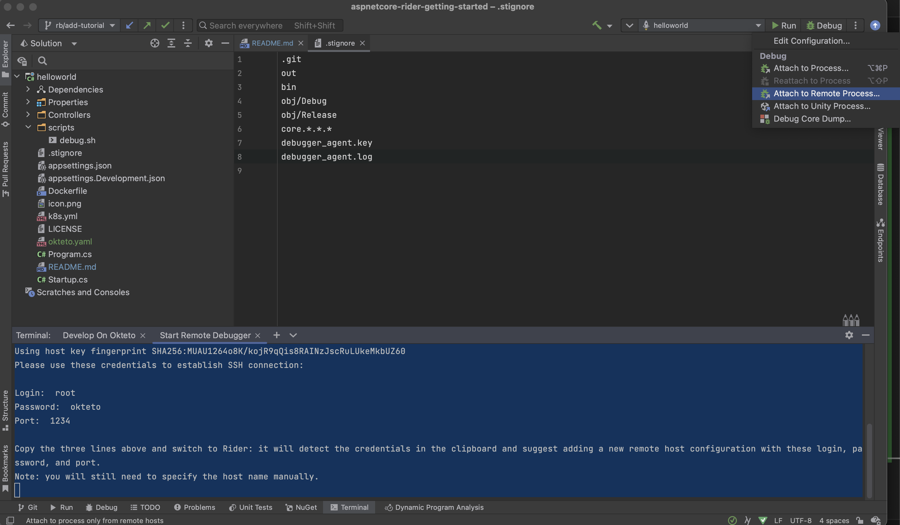
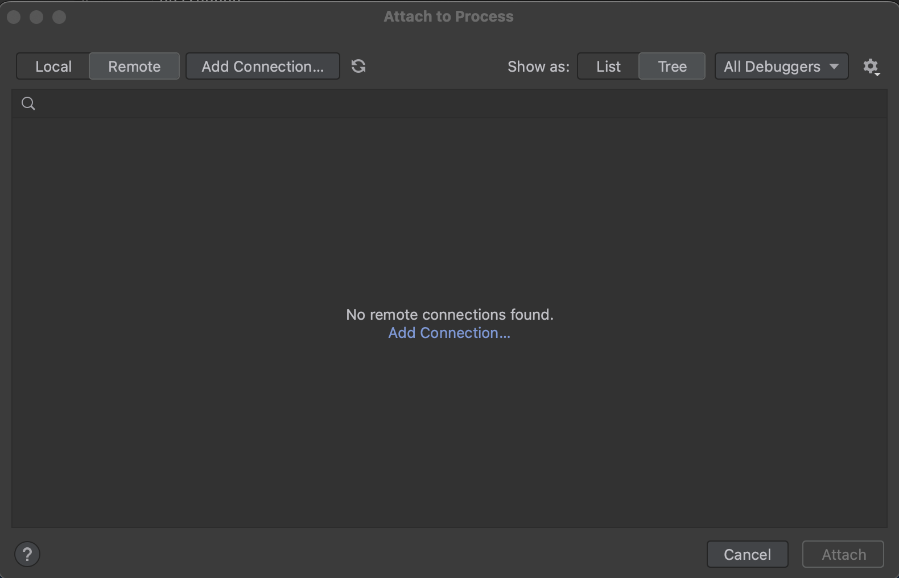
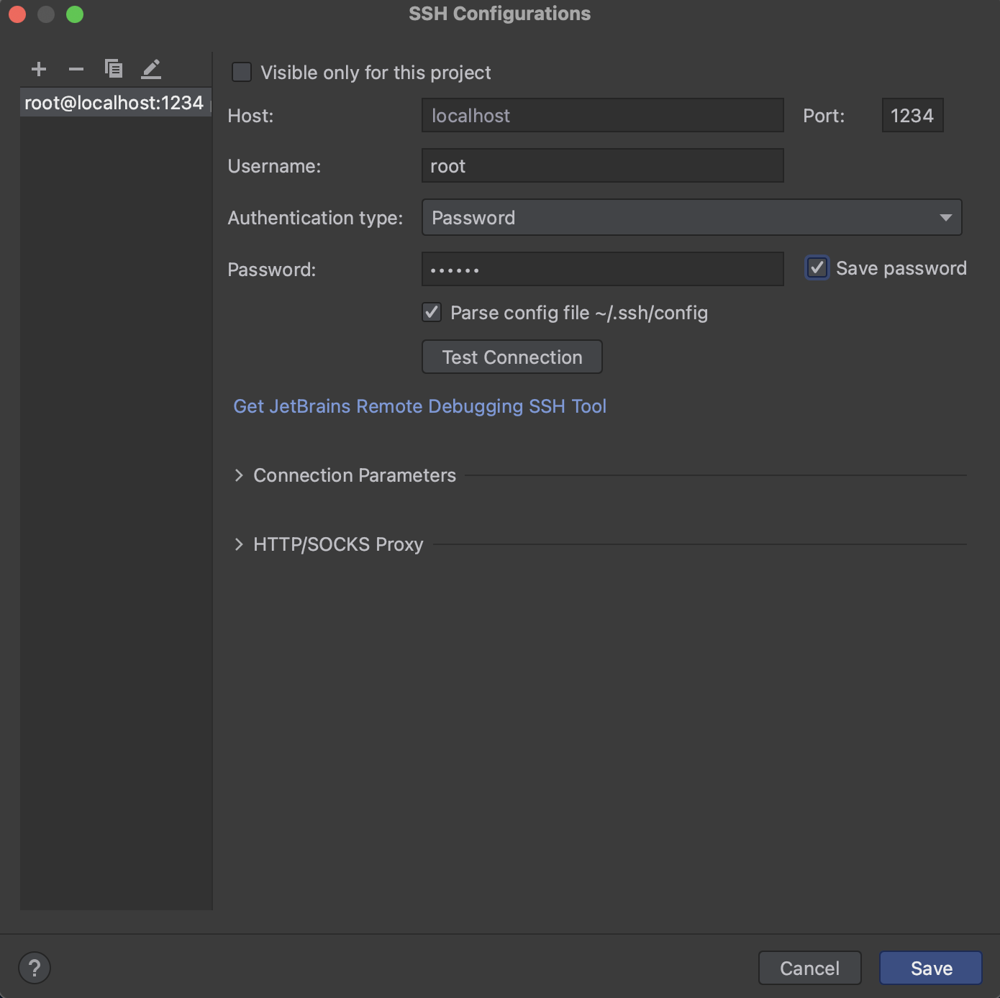
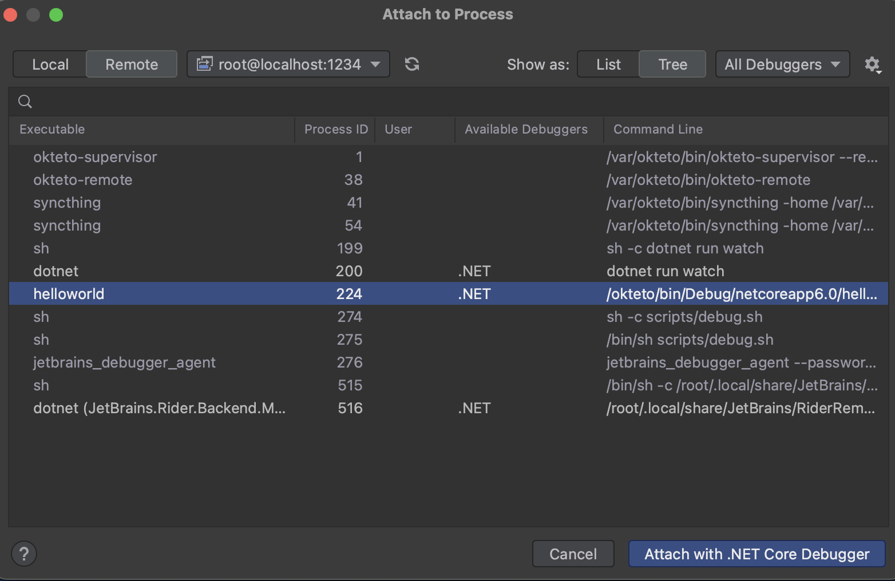
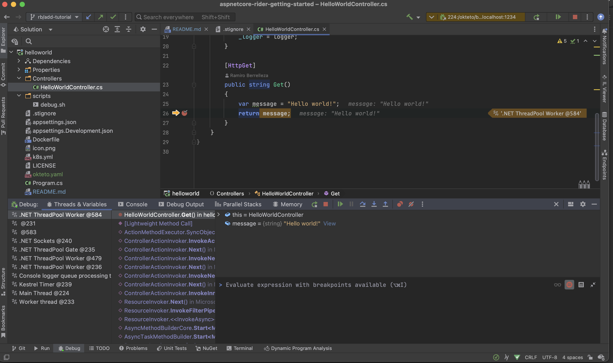

# Develop ASP.NET Apps in Kubernetes with Okteto and Jetbrains Rider

## Prerequisites
Install the latest version of the Okteto CLI. [Follow this guide](https://www.okteto.com/docs/getting-started/) if you haven't done it yet.


## Step 1: Deploy the ASP.NET Sample App

Get a local version of the ASP.NET Sample App by executing the following commands:

``` 
git clone https://github.com/okteto/aspnetcore-getting-started
cd aspnetcore-getting-started
```

You'll find the `okteto.yaml`  file at the root of the directory. This describes building, deploying, and developing the ASP.NET Sample App.

```
build:
  hello-world:
    image: okteto.dev/aspnet-hello-world:1.0.0
    context: .
  hello-world-dev:
    context: .
    target: dev
deploy:
  - kubectl apply -f k8s.yml
dev:
  hello-world:
    image: ${OKTETO_BUILD_HELLO_WORLD_DEV_IMAGE}
    command: dotnet run watch
    environment:
      - ASPNETCORE_ENVIRONMENT=Development
    forward:
      - 1234:1234
```

Deploy your development environment by executing:

```
okteto deploy
```

```
 i  Using cindy @ cloud.okteto.com as context
 i  Building image for service 'hello-world'
 i  Building the image 'okteto.dev/aspnet-hello-world:1.0.0' in tcp://buildkit.cloud.okteto.net:1234...
[+] Building 5.9s (11/11) FINISHED
 ...
 ✓  Image 'registry.cloud.okteto.net/cindy/aspnet-hello-world:1.0.0' successfully pushed
 i  Running kubectl apply -f k8s.yml
deployment.apps/hello-world created
service/hello-world created
ingress.networking.k8s.io/hello-world created
 ✓  Development environment 'aspnet-getting-started' successfully deployed
 i  Run 'okteto up' to activate your development container
 ```

 Open your browser and go to the URL of the application. You can get the URL by logging into Okteto and clicking on the application's endpoint.

 Did you notice that you're accessing your application through an HTTPS endpoint? This is because Okteto will [automatically create them](https://www.okteto.com/docs/cloud/ssl/) for you when you deploy your application. Cool, no 😎?

## Step 2: Activate your development container

[The dev section](https://www.okteto.com/docs/reference/manifest/#dev-object-optional)  of the manifest defines how to activate a development container for the ASP.NET Sample App:

```
dev:
  hello-world:
    image: ${OKTETO_BUILD_HELLO_WORLD_DEV_IMAGE}
    command: dotnet run watch
    environment:
      - ASPNETCORE_ENVIRONMENT=Development
    forward:
      - 1234:1234
```

The `hello-world` key matches the name of the hello world Deployment. The meaning of the rest of the fields is:

- image: the image used by the development container. More information on development images here and dynamic value for the tag.
- command: the start command of the development container. In this example, it starts the dotnet application with hot-reloading enabled.
- environment: the environment variables added or overwritten in your development container.
- forward: the ports exposed. In this case, 1234 is the port used by Rider for remote debugging.


Next, execute the following command to activate your development container and automatically start the application.

```
$ okteto up
```

```
 ✓  Persistent volume successfully attached
 ✓  Images successfully pulled
 ✓  Files synchronized
    Namespace: cindy
    Name:      hello-world

warn: Microsoft.AspNetCore.Server.Kestrel[0]
      Overriding address(es) 'https://localhost:5001, http://localhost:5000'. Binding to endpoints defined via IConfiguration and/or UseKestrel() instead.
info: Microsoft.Hosting.Lifetime[14]
      Now listening on: http://0.0.0.0:5000
info: Microsoft.Hosting.Lifetime[0]
...
```

Return to the browser and reload the page to test if your application is running. 

## Step 3: Develop directly in Okteto 

Open the file `Controllers/HelloWorldController. cs` in your favorite local IDE and modify the response message on line 25 to be Hello world from Okteto!. Save your changes.

```
[HttpGet]
public string Get()
{
    return "Hello world from Okteto!";
}
```

Look at the development container shell and notice how the changes are detected by dotnet watch run and automatically built and reloaded.

```
info: Microsoft.Hosting.Lifetime[0]
      Application is shutting down...
watch : Exited
watch : File changed: /src/Controllers/HelloWorldController.cs
watch : Started
info: Microsoft.Hosting.Lifetime[0]
      Now listening on: http://0.0.0.0:5000
info: Microsoft.Hosting.Lifetime[0]
      Application started. Press Ctrl+C to shut down.
info: Microsoft.Hosting.Lifetime[0]
      Hosting environment: Development
info: Microsoft.Hosting.Lifetime[0]
            Content root path: /src
```

Go back to the browser and reload the page. Your code changes were instantly applied. No commit, build, or push is required 😎!

## Step 4: Remote Debugging with Okteto and Rider

Okteto enables you to debug your applications directly from your favorite IDE. Let's take a look at how that works when using Okteto and [Jetbrains Rider](https://www.jetbrains.com/rider/)

### Start the Remote Debugger

Run the following command to start the debugger inside your development container. You don't have to install the debugger, is already included in the container we built during the deployment phase.

```
okteto exec -- scripts/debug.sh
```

```
 i  Using cindy @ cloud.okteto.com as context
Using host key fingerprint SHA256:XXXXX
Please use these credentials to establish SSH connection:

Login:  root
Password:  okteto
Port:  1234

Copy the three lines above and switch to Rider: it will detect the credentials in the clipboard and suggest adding a new remote host configuration with these login, password, and port.
Note: you will still need to specify the host name manually.
```

### Connect to the Remote Debugger

To start the remote debugger, click on the 'three dotted' button on the top right (next to the debug icon) and select 'Attach to a Remote Process'



If this is your first use, you'll see an empty dialog screen. 



Click on the 'Add Connection' link, and then fill the 'SSH Configurations' dialog with the following information:



- Host: `localhost`
- Port: `1234`
- Username: `root`
- Authentication Type: `Password`
- Password: `okteto` (you can change this to something more secure by editing the value on [script/debug.sh]
(script/debug.sh))

Check the `Save password` option, and click the Save button. 

If this is the first time you use this option on the container, Rider will upload the debugging tools. On a good internet connection, this should only take a few seconds. 



After this, you should see a list of the processes running on the remote development container. Select the process (`helloworld` in this example), and click on the `Attach with .NET Core Debugger` button to attach your IDE to the remote process. 

### Debugging Time!

Open `HelloWorldController.cs` in Rider and set a breakpoint on line 26. Go back to the browser and reload the page. As soon as the service receives the request, the execution will halt at your breakpoint, and Rider will jump to the front of the screen. You can then inspect the request, the available variables, etc.



Your code is executing in Okteto, but you can debug it from your local machine without any extra services or tools. Pretty cool, no? 😉
